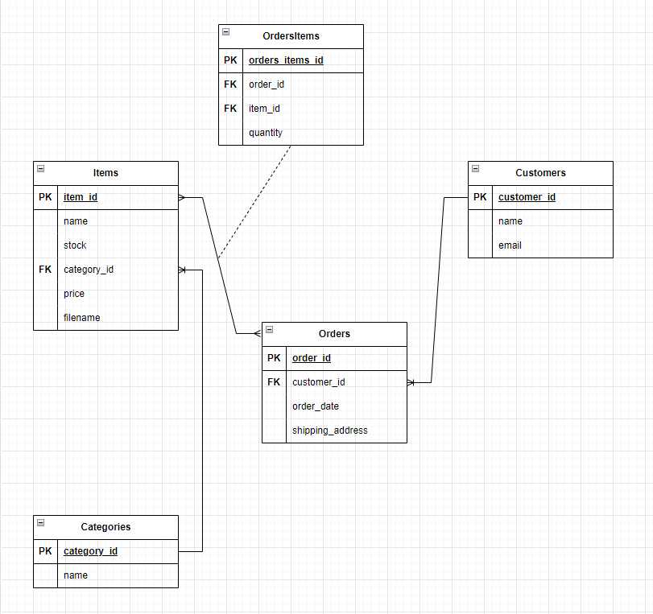

# QA Store 

## Introduction 

A simple online storefront regarding fashion and clothing.

The following sections highlight the main parts of the project, according to the brief specification. 

For a more in-depth review of the entire development workflow, please check the `workflow.pdf` file within this repository. The latter contains screenshots accompanied by relatively short captions depicting the entire project development step by step, including:

- how the project design has developed over time
- any major problems encountered
- more details on the sections discussed below
- Jira project details (backlog items left, cumulative flow diagram, burnup reports, and project timeline)

## Project Structure

```
$PROJECT_ROOT/
│   # application code
├─┬ application/
│ │   # static assets - CSS, JS, and images
│ ├── static/
│ │   # HTML templates
│ ├── templates/
│ │   # database models, forms, and custom form validators
│ ├── models.py
│ │   # route definitions 
│ └─┬ routes/
│   └── routes.py
│   # application tests
├─┬ tests/
│ │   # unit/integration tests
│ ├── test_app.py
│   # main application file
├── app.py
│   # required dependencies 
├── requirements.txt
│   # script to create mock up database
├── create.py
│   # README.md files
├── readme_utils/
├── workflow.pdf
├── .gitignore
└── README.md
```

## Tech Stack

1. Front-end
   - HTML, CSS and JS
2. Back-end
   - Python and Flask
3. Database
   - MySQL and SQLite
4. Unit and integration testing
   - `pytest` and `flask-testing`
5. Version Control and CI
   - Git and GitHub
   - Jenkins
6. Project Management - Agile
   - Jira (Kanban)

## Requirements Gathering
An exhaustive amount of time was initially put into gathering all the requirements - and thus tasks/issues - according to the specified Minimum Viable Product (MVP).

Given the initial project brief, the entire MVP was broken down into user stories, which were then categorised using epics. An essential step during this stage was to adequately prioritise each issue and organise the workload for each day of the given two 2-day sprints. To do so, we decided to incorporate two main techniques whilst defining each user story and relative sub-tasks: 

   1. *story points*
      - Fibonacci sequence
   2. *prioritisation*
      - lowest to highest


### MVP

Below is the MVP specified within the project brief. Every single requirement has a checkbox next to it specifying whether it has been completed or not.

1. Home page
   - [x] Welcoming page
   - [x] Visually appealing
   - [x] Default for the entire site
   - [x] Contain navigation to other sections of the site
   - [x] Communicate the site's purpose to the visitors
   - [x] Have pictures or graphics that are relevant to the products being sold
  
2. Products page
   - [x] Display product images, descriptions, and pricing
   - [x] Contain navigation to other sections of the site
   - [x] Have at least 4 different product images on display
   - [x] Each product should have its dedicated page with more details
   
3. Category page
   - [x] Display different product categories
   - [x] Contain navigation to other sections of the site
   - [x] Provide users with the ability to view products by category

4. Cart page
   - [x] Show all products added by the user to the cart
   - [x] Display the total price of all products in the cart
   - [x] Provide users with the ability to modify the quantity of each product in the cart
   - [x] Have an option to proceed to the checkout page

5. Checkout page
   - [x] Display a summary of the cart
   - [x] Be part of the overall site navigation
     - Note: access is restricted unless the cart is not empty
   - [x] Allow users to enter their shipping information

6. Payment page
   - [x] Collect payment information from the users such as cardholder's name, card number, expiry date, and security code/CVC
   - [x] Be part of the overall site navigation
     - Note: access is restricted unless the checkout page has not been submitted
   - [x] Include a mechanism for passing on the payment details to a mock external payment processor

7. Contact Us page
   - [ ] Include store address, phone number, and email
   - [ ] Be part of the overall site navigation
   - [ ] Include a contact form for users to submit inquiries or feedback

8. About Us page:
   - [ ] Be part of the overall site navigation
   - [ ] Provide information about the store, its mission, and its history
   - [ ] Include information about the team behind the store


### Reasoning behind unfinished parts of the MVP

The main reason why some parts of the MVP have not been completed (mainly everything regarding the Contact Us and 
the About Us page) is simply the limited given time. Whilst the About Us page's features were considered to be low in 
priority due to it not having any real functional contribution towards the application, the same cannot be said 
regarding the Contact Us page. 

More particularly, the latter contains one key component (i.e., submit customer feedback form) which was of a high 
priority. However, implementing this feature would have required an entire review of the analysis and design stages of
the SDLC. A new model would have most likely needed to be created in order to keep track of all the feedback sent by 
each user. Moreover, additional answers would have needed to be given to questions such as "Are both users and customers
able to send a feedback form? How would we implement an open ticket feature to keep track of unanswered feedback?" and
so on.

### Risk Assessment

A relatively simple risk assessment was conducted during the early stages of the requirements gathering stage. For each one, a mitigation method has been declared. To do so, a custom issue type had to be defined within Jira.


The following list is not exhaustive at all and must be further worked on. Additionally, other techniques could be incorporated such as the implementation of a risk assessment matrix for better analysis. 


## Analysis and Design

### Architecture
1. Presentation layer
   - The user interface
2. Application layer
   - Business logic, including processing orders
3. Data layer
   - Data storage and retrieval (interacting with the database)


### Entity-Relationship Diagram (ERD)

The creation of an entity-relationship diagram was essential during the early stages of the SDLC. Due to how Agile projects work, the latter has been continuously redefined in order to successfully meet the requirements set out during the requirements gathering step. 

With that being said, here is the most up-to-date version: 



### Classes definition

Similar to the creation of the ERD, defining our classes/models and reviewing how they would have interacted with each other was something that needed to be done in order to set up a good foundation for the later SDLC stages (i.e., coding, testing). 

Unfortunately, due to the limited time available for the completion of this project, many "problems" have not been addressed. For instance, the `shipping_address` field within the `Orders` module can be further improved from a modularity point of view. Additionally, the `filename` field within the `Items` class is - funnily - ambiguous, and the `email` field in the `Customers` module could effectively be used as the *primary key* instead of `customer_id`. However, in the current state and for what was achievable, all the modules were successfully designed following the 3 normalisation forms.

Here we can see how the models interact with each other using the Reverse Engineer feature of MySQL Workbench:


Moreover, a more in-depth specification regarding the components can be found below:

#### Customers

| Field | Data type | Constraints |
| --- | --- | --- |
| customer_id | INT | PK, AUTO_INCREMENT |
| name | VARCHAR(255) | NOT NULL |
| email | VARCHAR(255) | NOT NULL, UNIQUE |

#### Items

| Field | Data type | Constraints |
| --- | --- | --- |
| item_id | INT | PK, AUTO_INCREMENT |
| name | VARCHAR(255) | NOT NULL |
| stock | INT | NOT NULL, DEFAULT 0 |
| category_id | INT | FK, NOT NULL |
| price | FLOAT | NOT NULL |
| filename | VARCHAR(500) | NOT NULL |

#### Orders

| Field | Data type | Constraints |
| --- | --- | --- |
| order_id | INT | PK, AUTO_INCREMENT |
| customer_id | INT | FK, NOT NULL |
| order_date | DATETIME | NOT NULL |
| shipping_address | VARCHAR(255) | NOT NULL |

#### Categories

| Field | Data type | Constraints |
| --- | --- | --- |
| category_id | INT | PK, AUTO_INCREMENT |
| name | VARCHAR(255) | NOT NULL |

#### OrdersItems

| Field | Data type | Constraints |
| --- | --- | --- |
| orders_items_id | INT | PK, AUTO_INCREMENT |
| order_id | INT | FK, NOT NULL |
| item_id | INT | FK, NOT NULL |
| quantity | INT | NOT NULL |

## Development

The entire project has been developed using industry standards when discussing topics such as Continuous Integration or Version Control. 

For each new feature added to the project, a new `feature-___` branch has been created (although with certain discrepancies due to the limited time). Additionally, two main branches have been used to contain the application as a whole: `dev`, for stable OR unstable versions of the application (not for the end-user) and `main`, which is what the end-user would effectively get and must be stable (thus why the `dev` branch has been merged to it only as a last step - v1.0).

### Documentation and coding standards

Due to the limited time and the way documentation has the potential to continuously evolve within an Agile project, minimal effort - unfortunately - was put into things such as documentation. 

The latter would have been extremely useful to have in cohesion with unit/integration testing which, as it will be later explained, was set up within a Jenkins build server. 

Proper coding standards have been followed together with sufficient comments. Moreover, simple sentences in key parts of the code have been placed for future work (i.e., # TODO, // TODO ).

### CRUD features
- Admin
  - [ ] CRUD items to the database
  - [ ] CRUD categories to the database
  - Until the above features have been implemented, the `create.py` file is being used to create a mock database. In the latter, items and categories can be added/removed.
- Customer
  - [x] CRUD customer details to the database
- General
  - [x] Keep track of orders (as well as customer details and item details associated with orders)

### Open issues/bugs
- [ ] Item stock level to item quantity level in cart
  - If a user adds an item to the cart and then goes back to the products page and re-adds it, there are no checks to verify whether the total cart item quantity is lower than the overall item stock quantity. This check is available only within the add item to cart function.

### Future work
- [ ] Complete unfinished parts of the MVP (see section above)
- [ ] Code refactoring: 
  - [ ] Improve modularity
    - [ ] unit and integration testing
    - [ ] models
    - [ ] routes
  - [ ] Improve documentation and comments
  - [ ] Review the creation of a test database for performing unit/integration testing
- [ ] Implement a risk assessment matrix
- [ ] Implement and review payment processing
  - at the moment, it is only a `process_payment` function which always returns `"success"`
- [ ] Implemented `Country` dropdown within the `checkout` page
- [ ] Add custom form validators to the `checkout` page

## Testing

A combination of both unit and integration testing has been used to carry out the testing stage of the SDLC. Due to the limited time, the modularity of the latter is relatively low (everything in one file, using only two classes: `TestViews` and `TestCRUD`). 

### Coverage

Most of the focus has been placed on testing each one of the application's routes and whether the entire "customer flow" worked as expected. However, given the fact that they amount to most of the application's logic, we were able to achieve a relatively high testing coverage. The latter can be seen below:


Regarding the code which has not been covered in the current testing, it is part of one of the following two sections:

1. Form validators
   
   
2. Parts of code which represent features not implemented yet
   
   

### Jenkins

One important point to make is that we decided to use Jenkins as a build server in such a way as to not have to manually run the tests every time. To do so, we set up a freestyle job and achieved the artefacts on the build trigger. The latter uses a testing SQLite database which is saved in memory and does not affect our "production" database.


There also was the intent to set up a GitHub Webhook in order to automatically trigger the Jenkins build. However, due to how we configured Jenkins (local), doing so would have required a comprehensive amount of time. 

## Usage

### Normal application usage

1. Create a database using MySQL
   ```SQL
      CREATE DATABASE fashionable;
   ```
2. Create a `.env` file in the project root which will contain the following
   ```sh
      DB_TYPE="mysql+pymysql://"
      DB_USER="<your_username>:"
      DB_PASSWORD="<your_database_password>"
      DB_HOST="@<host_name>:<port_number>"
      DB_NAME="/fashionable"
      SECRET_KEY="<your_secret_key>"
      FLASK="production" 
   ```
3. Set up a virtual environment and activate it (Windows)
   ```sh
      py -m venv venv
      source venv/Scripts/Activate 
   ```
4. Install required dependencies
   ```sh
      pip install -r requirements.txt
   ```
5. Run `create.py` to create a mock database with products and items
   ```sh
      py create.py
   ```
6. Run `app.py` to start the application
   ```sh
      py app.py
   ```
7. Go to `127.0.0.1:5000/`

### Performing manual testing

1. Change the `FLASK` environment variable in the `.env` file created previously
   ```sh
      FLASK="testing" 
   ```
2. Set up a virtual environment and activate it (Windows)
   ```sh
      py -m venv venv
      source venv/Scripts/Activate 
   ```
3. Install required dependencies
   ```sh
      pip install -r requirements.txt
   ```
4. Manually run tests
   1. Without coverage report
      ```sh
      py -m pytest --cov=application
      ```
   2. With coverage report
      ```sh
      py -m pytest --cov=application --cov-report html
      ```

### Performing testing using Jenkins

1. Create a database using MySQL
   ```SQL
      CREATE DATABASE fashionable;
   ```
2. Set up a Jenkins job
   1. Freestyle project
   2. Source Code Management 
      1. Select Git
      2. Enter the repository URL
      3. Specify `*/dev` as the branch to build
   3. Build Environment (set up environment variables)
      - `DB_TYPE`
        - Must be set to `mysql+pymysql://`
      - `DB_USER`
        - `<your_username>:` 
        - be careful about which hosts your user has access from
      - `DB_PASSWORD`
        - `<your_database_password>`
      - `DB_HOST`
        - `@<host_name>:<port_number>`
      - `SECRET_KEY`
        - Your secret key
      - `DB_NAME`
        - Must be set to `fashionable` 
        - else just the database name you created for the project
      - `FLASK`
        - Must be set to `testing` in order to not override the production database 
   4. Create an execute shell build step
      ```sh
         sudo apt update && sudo apt install python3 python3-pip python3-venv -y
         python3 -m venv venv
         bash -c "source venv/bin/activate"
         pip3 install -r requirements.txt
         python3 -m pytest --cov=application --cov-report html
      ```
   5. Set up two post-build actions
      1. Achieve the artefacts
         - `htmlcov/*`
      2. Delete workspace when the build is done
## References
- [Banner image](https://unsplash.com/photos/hanged-top-on-brown-and-white-clothes-horse-TS--uNw-JqE)
- [Products images](https://www.kaggle.com/datasets/vikashrajluhaniwal/fashion-images)
- [Bootstrap](https://getbootstrap.com/) 
- [Axios](https://axios-http.com/docs/intro)
- [Flask documentation](https://flask.palletsprojects.com/en/2.3.x/)
